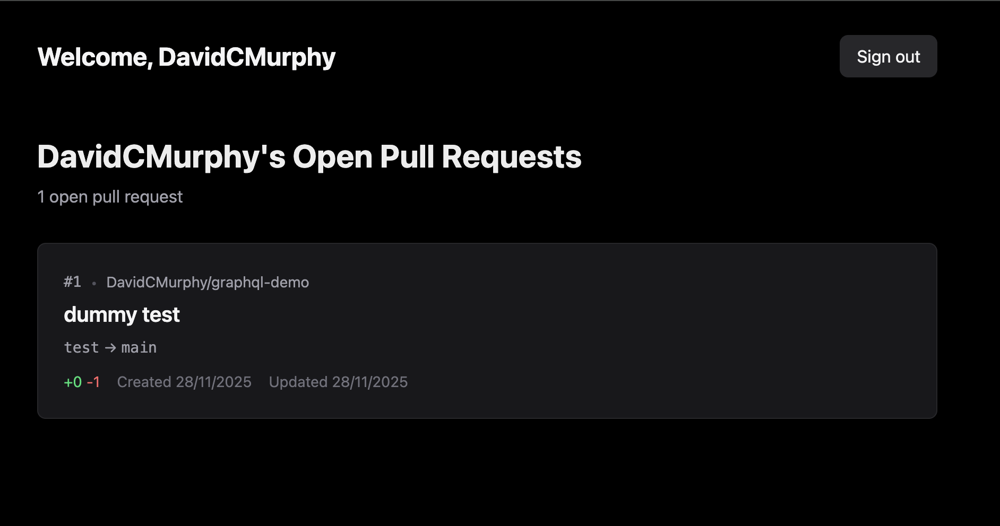

# GitHub GraphQL Demo with Relay



A Vite + React application that authenticates with GitHub using OAuth and displays your open pull requests using the GitHub GraphQL API with Relay.

## Features

- 🔐 GitHub OAuth authentication
- 📊 GraphQL queries using Relay
- 🔀 View all your open pull requests across repositories
- 📈 See PR status, review decisions, and code changes
- 🎨 Modern UI with Tailwind CSS
- 📱 Responsive design
- 🌙 Dark mode support
- ⚡ Type-safe with TypeScript
- 🚀 Fast development with Vite

## Tech Stack

- **Vite** - Build tool and dev server
- **React 18** - UI library
- **React Router** - Client-side routing
- **Relay** - GraphQL client
- **Express** - OAuth token exchange server
- **GitHub GraphQL API** - Data source
- **Tailwind CSS v4** - Styling
- **TypeScript** - Type safety

## Setup Instructions

### 1. Create a GitHub OAuth App

1. Go to [GitHub Developer Settings](https://github.com/settings/developers)
2. Click "New OAuth App"
3. Fill in the details:
   - **Application name**: GraphQL Demo (or any name)
   - **Homepage URL**: `http://localhost:3000`
   - **Authorization callback URL**: `http://localhost:3000/callback`
4. Click "Register application"
5. Copy the **Client ID**
6. Generate a new **Client Secret** and copy it

### 2. Configure Environment Variables

1. Copy the example environment file:

   ```bash
   cp .env.example .env
   ```

2. Edit `.env` and add your credentials:
   ```env
   VITE_GITHUB_CLIENT_ID=your_github_client_id
   GITHUB_CLIENT_SECRET=your_github_client_secret
   VITE_REDIRECT_URI=http://localhost:3000/callback
   PORT=3001
   ```

### 3. Install Dependencies

```bash
npm install
```

### 4. Compile Relay Queries

```bash
npm run relay
```

### 5. Run the Application

This will start both the OAuth server (port 3001) and Vite dev server (port 3000):

```bash
npm start
```

Or run them separately:

```bash
# Terminal 1 - OAuth server
npm run server

# Terminal 2 - Vite dev server
npm run dev
```

Open [http://localhost:3000](http://localhost:3000) in your browser.

## Usage

1. Click "Sign in with GitHub" on the homepage
2. Authorize the application
3. View your open pull requests with details like:
   - PR title and number
   - Repository name
   - Branch information (head → base)
   - Review decision status (Approved, Changes Requested, Review Required)
   - Draft status
   - Code changes (+additions / -deletions)
   - Created and updated dates

## Project Structure

```
├── src/
│   ├── components/
│   │   ├── PullRequestList.tsx  # Pull request list with Relay query
│   │   └── ErrorBoundary.tsx    # Error boundary component
│   ├── pages/
│   │   ├── HomePage.tsx         # Main page with auth logic
│   │   └── CallbackPage.tsx     # OAuth callback handler
│   ├── lib/
│   │   ├── auth.ts              # OAuth authentication logic
│   │   └── relay/
│   │       └── environment.ts   # Relay environment
│   ├── App.tsx                  # Root app component
│   ├── main.tsx                 # App entry point
│   └── index.css                # Global styles
├── __generated__/               # Relay generated files
├── server.js                    # OAuth token exchange server
├── vite.config.ts               # Vite configuration
├── relay.config.js              # Relay compiler configuration
└── schema.graphql               # GitHub GraphQL schema
```

## Available Scripts

- `npm start` - Start both OAuth server and Vite dev server
- `npm run dev` - Start Vite development server only
- `npm run server` - Start OAuth server only
- `npm run build` - Build for production (includes Relay compilation)
- `npm run preview` - Preview production build
- `npm run relay` - Compile Relay queries
- `npm run lint` - Run ESLint

## Learn More

- [Vite Documentation](https://vite.dev/)
- [React Documentation](https://react.dev/)
- [Relay Documentation](https://relay.dev/docs/)
- [React Router Documentation](https://reactrouter.com/)
- [GitHub GraphQL API](https://docs.github.com/en/graphql)
- [Tailwind CSS](https://tailwindcss.com/docs)
